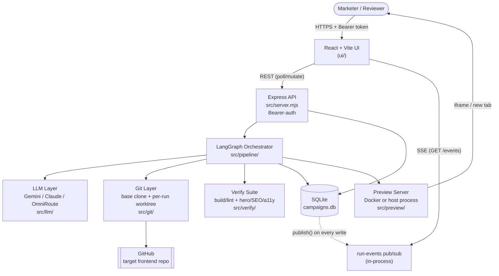
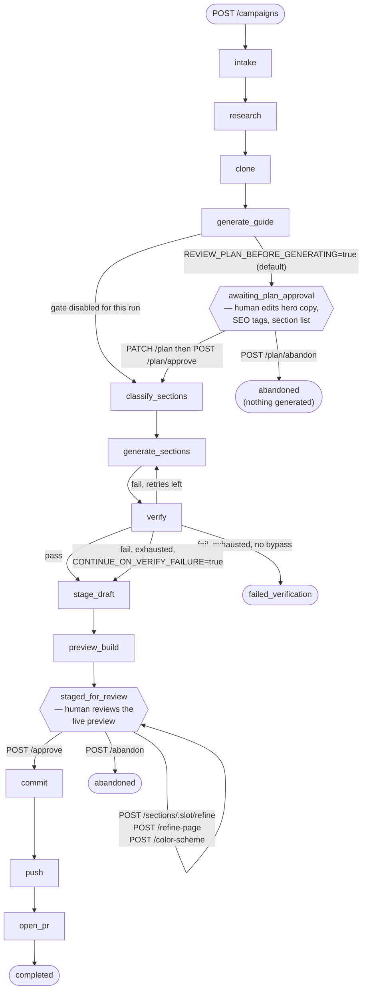
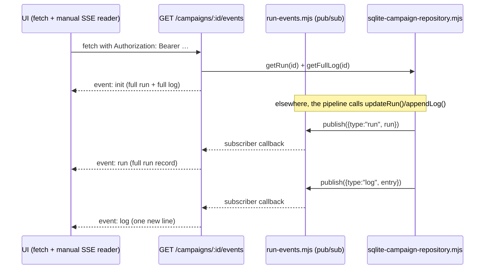

# Runbook: landing page automation

Professional implementation record, operating guide, and continuation plan

Last updated: 2026-08-24 (through changelog entry v0.43)

---

## 1. Executive Summary

`landing page automation` is a standalone Node.js service that turns a
marketing campaign brief into a **pull request on a separate, external
frontend repository**. It never modifies its own codebase — it clones a
target repo (currently `atss-frontend`), writes new campaign-landing-page
files into it via an LLM-driven agentic coding loop, verifies the result with
a deterministic build/lint/layout/SEO/accessibility suite, stages it for a
live human-reviewable preview, and — only after an explicit human approval —
commits, pushes a branch, and opens a GitHub PR.

The core guarantee the whole design serves: **no existing file in the target
repo is ever modified, and no code reaches git without both passing
verification and a human clicking approve.**

This document is the single place a new developer (or a future session of
this assistant) can read top to bottom and understand: what the system does,
why it's built the way it is, every environment variable and what it
controls, how to set it up and run a campaign from zero, the full request/
pipeline flow, the HTTP API, the database shape, what's been built in what
order, and what's still open.

It draws on and supersedes the narrative in [`full_doc.md`](full_doc.md) remain useful for deeper prose on individual topics, but this file is the current, single source of
truth for "how do I run this and what does it do right now."

---

## 2. Working Principles

These are the design rules the codebase itself enforces (in code, not just
in comments) — read them before changing anything.

- **Humans set the boundaries, code enforces them.** The write allowlist
  (`WRITE_PATH_ALLOWLIST`) and the page route (`PAGE_URL_PATH_TEMPLATE`) are
  set by a human who has looked at the real target repo. The agent operates
  strictly inside them; it cannot derive or widen them itself.
- **New files only, never modify existing ones.** Enforced by four
  independent write guards in [`src/llm/filesystem-tools.mjs`](src/llm/filesystem-tools.mjs)
  (containment, pristine-file protection, allowlist, manifest) — a hole in
  one layer does not defeat the others. See §5.4.
- **No broken PRs.** A deterministic verify suite (build, lint, hero layout,
  SEO, accessibility) gates every path to git. A failing run that exhausts
  its retries ends the run — it never reaches commit/push/open-PR.
- **Deterministic verification, not LLM self-assessment.** Nothing the model
  *claims* it did is trusted; the orchestrator runs real build/lint/browser
  checks itself.
- **Nothing reaches git without an explicit human decision.** The pipeline
  graph physically cannot commit, push, or open a PR — those functions live
  outside the graph and are invoked only by a later, separate HTTP request
  once a human clicks Approve.
- **The database is the source of truth, not the worktree.** What gets
  committed is read from the `draft_files` table, never from disk. A failed
  or half-finished run's scratch worktree is disposable — it was never
  staged, so it can never be committed.
- **Not everything should be AI-generated.** Most page sections are
  assembled from real, existing components in the target repo with zero LLM
  involvement ("Hybrid Section Assembly," §5.2). Only sections that genuinely
  need original copy (always the hero, optionally others) go through the
  agentic coding loop.
- **Provider-agnostic, stack-agnostic.** The one-shot LLM stages and the
  coding-agent loop each independently support Gemini, Claude, or a local
  OmniRoute gateway. The target repo's own framework (Next.js, Laravel, Vue,
  plain HTML…) is detected after clone, never assumed.
- **Verification-first delivery.** Every phase in this project's history
  (§9) was validated against real builds, a real (if fake-keyed) pipeline
  run, real HTTP calls, or targeted unit tests — never "it should work."
- **Real fixtures, never mocks, for git/filesystem/LLM-adjacent code.**
  Tests use real `mkdtemp` directories and real `git init --bare` fixtures.
  The LLM itself is never mocked — AI-touching code is tested via real API
  calls (when a key is available) or pure/structural checks around it.

---

## 3. Project Architecture Overview

| Component | Location | Purpose | Status |
|---|---|---|---|
| HTTP API | `src/server.mjs` | Express app — the only entry point. Auth, all routes, boot-time crash reconciliation. | Working |
| LangGraph orchestrator | `src/pipeline/` | State machine deciding which pipeline stage runs next. | Working |
| LLM layer | `src/llm/` | Hand-rolled `fetch()` calls to Gemini/Claude/OmniRoute — no LangChain model wrapper. The agentic coding loop + its write guard. | Working |
| Section assembly | `src/sections/`, `src/design-catalog/` | Hybrid static-template / AI-generation per section, grounded in the real target repo's components. | Working |
| Git layer | `src/git/` | Shared base clone + per-run `git worktree`; sibling-campaign quarantine. | Working |
| Verify suite | `src/verify/` | Build/lint, then (if configured) hero-fit, SEO, and accessibility checks via a real ephemeral server + Playwright. | Working (browser checks require Chromium install — see §7) |
| Staging & preview | `src/staging/`, `src/preview/` | Versioned generated files in SQLite (what actually gets committed) + a long-lived, human-viewable preview sandbox. | Working |
| Real-time updates | `src/state/run-events.mjs`, `run-events-sse.mjs` | In-process pub/sub + SSE endpoint pushing run status/log to the UI in real time. | Working (added v0.43, this session) |
| State / persistence | `src/state/` | SQLite via `node:sqlite`, one shared WAL-mode connection, idempotent schema. | Working |
| Frontend UI | `ui/` | React + Vite SPA — campaign creation, plan editing, section refine gallery, live preview iframe, approve/abandon. | Working |
| GitHub integration | `src/github/open-pull-request.mjs` | Opens the final PR via the GitHub REST API. | Working |
| Lead form contract | `src/leadform/contract.mjs` | Shared hero lead-form field contract + honeypot + no-op preview sink. | Working; real delivery to a parent lead pipeline is an external dependency, not built |
| Campaign images | `src/assets/campaign-images.mjs` | Pexels/SerpAPI stock photo sourcing + Supabase storage, with manual-upload override. | Working, fully optional |
| Observability | — | `token_usage` table exists; nothing writes to it. `/healthz` is liveness-only. | Not built (Phase 10) |

---

## 4. System Flow Diagrams

### 4.1 High-level architecture



### 4.2 Pipeline + human review lifecycle

This is the actual current graph in
[`src/pipeline/run-campaign-pipeline.mjs`](src/pipeline/run-campaign-pipeline.mjs),
including the plan gate (v0.37) and the fact that commit/push/open-PR are
**not** graph nodes (Phase 7) — they only run from a separate later request.



Notes:
- `clone` deliberately runs **before** `generate_guide` — the target repo's
  real stack (Next.js? Laravel? plain HTML?) is detected from the fresh
  checkout so the guide plans against reality instead of an assumption.
- `generate_sections` fans out: static sections are pure templating (no
  LLM), and every AI-required section (always including the hero) gets its
  own independent, single-file coding-agent run, all running concurrently.
- A verify retry is a **targeted repair**, not a re-roll: only the sections
  the build report actually blames are regenerated; sections that already
  compiled are carried forward unchanged.
- Every action inside `staged_for_review` re-runs the **full-page** verify
  suite before re-staging, since a single section swap can affect page-wide
  layout, SEO, or accessibility.

### 4.3 Real-time run updates (SSE) — added v0.43



Native `EventSource` cannot send the `Authorization` header this API
requires on every route, so the UI opens this endpoint with `fetch` and a
hand-rolled SSE parser (`ui/src/api.ts`'s `watchRunEvents`) instead of the
browser's built-in `EventSource` — keeping one auth mechanism for the whole
API rather than adding a weaker query-token path for just this endpoint.
Draft/preview/plan are **not** on this stream (they change via separate
refine/preview actions) and are still polled by the UI every 2s, decoupled
from run/log.

---

## 5. Feature Inventory

### 5.1 Campaign generation
- Brief intake with strict Zod validation (`campaignName`, `slug`, `offer`,
  `audience`, `cta`, free-text `brief`, optional `videoUrl`, optional content
  rules — tone, page length, must/must-not-include, banned words).
- Web-search-backed research stage (keywords, pain points, FAQ questions),
  skippable via `SKIP_RESEARCH`.
- Two-phase content planning: one outline call, then one independent
  elaboration call **per section**, run concurrently, each grounded in that
  section type's real reference component from the target repo.
- A fixed, closed set of 9 section types (`hero`, `details`, `timeline`,
  `testimonials`, `faq`, `curriculum`, `pricing`, `instructor`,
  `footer-cta`) — the model cannot invent new ones.

### 5.2 Hybrid Section Assembly
- Per-section classification: static (templated from a real existing
  component, zero LLM) vs. AI-required (always the hero; anything else the
  static catalog can't faithfully cover degrades gracefully to AI).
- Static sections still get campaign-specific AI-authored copy where the
  frame allows it (v0.39) — "static" means "no code generation," not
  "generic placeholder text."
- AI-required sections each run their own independent, single-file coding
  agent, concurrently, never touching more than one file.
- Deterministic composition of the final `page.tsx` from section results —
  no LLM involved in assembly itself.

### 5.3 Safety-critical write guard
- Exactly four tools available to the coding agent: `list_files`,
  `read_file`, `write_file`, `finish_coding`. **No shell tool, ever.**
- Every write passes four independent checks: path containment, pristine-
  file protection (never touch a file that existed before the run), an
  operator-configured allowlist, and an exact per-run file manifest.

### 5.4 Deterministic verification
- Build + lint first (ecosystem-aware: npm/yarn/pnpm, optionally Docker).
- If servable and a page route is configured: hero-above-the-fold (2
  viewports, Playwright), SEO tag correctness, and accessibility (axe-core)
  — all against one real ephemeral server instance.
- Targeted-repair retries: a build failure is parsed for the files it
  actually blames; only those sections regenerate.
- Foreign-failure detection: a target repo that doesn't build on its own
  (e.g. a poisoned sibling campaign) is recognized and doesn't burn this
  run's retry budget.
- `CONTINUE_ON_VERIFY_FAILURE` escape hatch (off by default, loudly flagged
  in the UI when used).

### 5.5 Human-in-the-loop review, twice
- **Plan gate** (default on): after the content plan is generated but
  before any code is written, a human can edit hero copy, SEO tags, and the
  section list — free to change here, costs an AI run per section to change
  later.
- **Generation gate**: after a verified draft is staged and previewed, a
  human must explicitly approve (→ commit/push/open PR) or abandon. Nothing
  reaches git otherwise.
- **Per-section refine**, without regenerating the whole page:
  `use-different-frame` (swap static candidate), `modify` (AI edits in
  place), `redesign` (force AI rewrite), `new` (change section type).
- **Whole-page AI refine** (`refine-page`) — one plain-language instruction
  that can touch several sections in one pass.
- **Palette recolor** (`color-scheme`) without any AI call.
- Every refine action re-runs the full-page verify suite and re-stages a
  new version before the preview refreshes.

### 5.6 Live preview sandbox
- A long-lived (not request-scoped) preview server per run, Docker-first
  with a host-process fallback, capped concurrency, idle-timeout sweep, and
  boot-time reconciliation.
- A "frameable proxy" strips the target repo's `X-Frame-Options: DENY` so
  the review UI can actually `<iframe>` the live page.
- A no-op, honeypot-aware lead-sink endpoint so reviewers can click through
  the generated form without a real lead ever being sent anywhere.

### 5.7 Real-time UI updates (new, v0.43)
- Server-Sent Events stream (`GET /campaigns/:runId/events`) pushing run
  status/stage and new log lines to the browser as they happen, replacing
  the previous 2-second poll for that data. See §4.3.

### 5.8 Crash resilience
- Boot-time reconciliation: runs interrupted mid-generation are safely
  re-driven (reusing already-paid-for research/plan output); runs mid-
  commit/push are never auto-resumed and are flagged for manual GitHub
  checking; runs already waiting on a human are left untouched.

### 5.9 Campaign imagery (optional subsystem)
- Automatic stock-photo sourcing (Pexels, falling back to SerpAPI) per
  image slot, uploaded to Supabase Storage.
- Manual image upload/override per slot from the review UI, which also
  live-patches the already-staged draft files with the new URL.
- Entirely optional — missing keys mean the campaign still generates, just
  with the frame catalog's dummy assets.

### 5.10 Provider flexibility
- `AI_PROVIDER` and `CODING_AGENT_PROVIDER` are independent — mix and match
  Gemini, Claude, or a local OmniRoute (OpenAI-compatible) gateway for the
  one-shot stages vs. the agentic coding loop.

---

## 6. Configuration Reference

All variables live in `.env` (start from `.env.example`), loaded and
validated **once, at import** by [`src/config.mjs`](src/config.mjs) using
Zod. A missing or malformed variable refuses to boot with a precise error
instead of failing mysteriously mid-run. Every other module reads from
`config`, never `process.env` directly.

### 6.1 Server & auth

| Variable | Default | What it controls |
|---|---|---|
| `PORT` | `4300` | Port the Express API listens on. |
| `API_SHARED_SECRET` | *(required, ≥16 chars)* | Bearer token required on every `/campaigns*` route. This service can push real code to a real repo — never run it unauthenticated. |

### 6.2 AI providers — one-shot stages & the coding agent

| Variable | Default | What it controls |
|---|---|---|
| `AI_PROVIDER` | `gemini` | Provider for research + guide planning. `gemini` \| `claude` \| `omniroute`. |
| `CODING_AGENT_PROVIDER` | `claude` | Provider for the agentic per-section coding loop — **independent** of `AI_PROVIDER`; mix freely. |
| `GEMINI_API_KEY` | *(required if either provider above is `gemini`)* | Gemini API key. |
| `GEMINI_MODEL` | `gemini-2.5-flash` | Gemini model id. |
| `ANTHROPIC_API_KEY` | *(required if either provider above is `claude`)* | Claude API key. |
| `CLAUDE_MODEL` | `claude-sonnet-5` | Claude model id. |
| `CODING_AGENT_MODEL` | *(falls back to the coding provider's own model)* | Override just the coding agent's model, independent of the one-shot stages' model. |
| `OMNIROUTE_BASE_URL` | `http://localhost:20128/v1` | Local OpenAI-compatible gateway, used when either provider above is `omniroute`. |
| `OMNIROUTE_API_KEY` | *(optional)* | A default local OmniRoute install accepts unauthenticated requests. |
| `OMNIROUTE_MODEL` | `auto` | Pin a real model id from the OmniRoute dashboard — `auto`'s free pool (Felo/OpenCode) frequently 400s/401s. |
| `MAX_AGENT_ITERATIONS` | `40` | Tool-call cap per section's coding loop. Hitting it without `finish_coding` is a hard failure, never silently accepted. |
| `MAX_CODE_ATTEMPTS` | `3` | Generation attempts per run, including targeted-repair retries. |
| `SKIP_RESEARCH` | `false` | Skip the web-search research LLM call — fast iteration during development. |

### 6.3 Plan gate

| Variable | Default | What it controls |
|---|---|---|
| `REVIEW_PLAN_BEFORE_GENERATING` | `true` | Pause the run at `awaiting_plan_approval` after the content plan exists, before any section is generated. Per-campaign override via the brief's `reviewPlan` field. |

### 6.4 Verification

| Variable | Default | What it controls |
|---|---|---|
| `PACKAGE_MANAGER_OVERRIDE` | *(auto-detect)* | Force `npm` \| `yarn` \| `pnpm` when lockfile detection would pick the wrong one. |
| `VERIFY_DISABLE_DOCKER` | `true` | **Default since v0.32.** Verify/preview run the target repo's own `npm ci`/`build`/`start` on this host. Set `false` to build inside the repo's own declared Node image via Docker instead (only engages when the repo has a usable Dockerfile and Docker is reachable) — safer against Node-version mismatches, but historically the largest source of failed runs (image pulls, bind-mount permissions, orphaned containers). |
| `VERIFY_INSTALL_TIMEOUT_MS` | `300000` | Install step timeout. |
| `VERIFY_BUILD_TIMEOUT_MS` | `600000` | Build step timeout. |
| `VERIFY_SERVER_TIMEOUT_MS` | `30000` | Ephemeral verify-server startup timeout. |
| `ENABLE_HERO_FIT_CHECK` | `true` | Turn off just the hero-above-the-fold Playwright check (reported SKIPPED, not silently passed). |
| `ENABLE_A11Y_CHECK` | `true` | Turn off just the axe-core accessibility check. |
| `PAGE_URL_PATH_TEMPLATE` | *(unset)* | e.g. `/campaigns/{slug}`. Must match what `WRITE_PATH_ALLOWLIST` actually produces. **Unset ⇒ hero-fit/SEO/a11y are skipped entirely** (build/lint still gates) **and the preview falls back to the target repo's home page.** |
| `CONTINUE_ON_VERIFY_FAILURE` | `false` | ⚠️ Stage an **unbuildable** draft for review anyway once retries are exhausted, flagged loudly in the UI. Approving one opens a PR with code that does not compile. Temporary unblock, not a normal mode. |

### 6.5 Preview sandbox

| Variable | Default | What it controls |
|---|---|---|
| `PREVIEW_TTL_MS` | `1800000` (30 min) | Idle lifetime before the sweep tears a preview down. |
| `MAX_CONCURRENT_PREVIEWS` | `3` | Soft cap — the oldest preview is evicted to make room, not refused. |
| `PREVIEW_SWEEP_INTERVAL_MS` | `60000` | How often the idle-preview sweep runs. |
| `SERVICE_PUBLIC_BASE_URL` | `http://localhost:<PORT>` | Where a previewed page's lead form POSTs — the preview is a separate process/port, so it can't use a relative path. **Set explicitly for any real deployment.** |

### 6.6 Git & target repo

| Variable | Default | What it controls |
|---|---|---|
| `GITHUB_TOKEN` | *(required unless `DRY_RUN_NO_PR=true`)* | Auth for cloning (if private) and opening PRs. |
| `GITHUB_TARGET_OWNER` | *(required)* | Owner of the repo this service writes into. |
| `GITHUB_TARGET_REPO` | *(required)* | Name of that repo. |
| `GITHUB_BASE_BRANCH` | `main` | Branch PRs are opened against. |
| `GITHUB_API_URL` | `https://api.github.com` | Override for GitHub Enterprise. |
| `TARGET_REPO_CLONE_URL` | *(constructed from owner/repo)* | Override with a local `git init --bare` fixture path for a fully safe dry run. |
| `DRY_RUN_NO_PR` | `false` | Skip **only** the GitHub "open PR" API call — clone/generate/verify/commit/push all still run for real. Combine with a local `TARGET_REPO_CLONE_URL` for a zero-risk end-to-end run. |
| `WRITE_PATH_ALLOWLIST` | *(required)* | Comma-separated path prefixes (`{slug}` substituted per run) the agent may write inside. **Set this by looking at the real target repo's structure first** — layer 3 of the write guard, and the single most common source of real production failures (v0.18). |
| `GIT_AUTHOR_NAME` / `GIT_AUTHOR_EMAIL` | bot defaults | Commit author identity. |

### 6.7 Storage & lifecycle

| Variable | Default | What it controls |
|---|---|---|
| `DB_PATH` | `./data/campaigns.db` | SQLite file — created automatically. |
| `WORKDIR_ROOT` | `./data/.scratch` | Base clone (`_base`) + per-run worktrees live here. |
| `KEEP_WORKDIR_ON_FAILURE` | `false` | Keep a failed run's scratch worktree on disk — **essential for debugging** a real failure. |
| `RESUME_INTERRUPTED_RUNS` | `true` | Re-drive runs a previous process lifetime left mid-generation, reusing cached research/plan output. Never resumes anything mid-commit/push regardless of this setting. |

### 6.8 Campaign imagery (fully optional)

| Variable | Default | What it controls |
|---|---|---|
| `PEXELS_API_KEY` | *(optional)* | Stock photo search, primary source. |
| `SERPAPI_API_KEY` | *(optional)* | Stock photo search fallback. |
| `SUPABASE_URL` | *(optional)* | Where sourced/uploaded campaign images are stored. |
| `SUPABASE_SERVICE_ROLE_KEY` | *(optional)* | Supabase auth for the storage write. |
| `SUPABASE_STORAGE_BUCKET` | `campaign-images` | Bucket name. |

Missing any of the imagery vars simply skips image search/upload — the
campaign still generates, using the frame catalog's dummy assets.

> **Note:** `.env.example` in the repo predates several of the vars above
> (`REVIEW_PLAN_BEFORE_GENERATING`, `SERVICE_PUBLIC_BASE_URL`, and the
> imagery block). This runbook (and `src/config.mjs`, always the ground
> truth) already reflects all of them; `.env.example` has been brought back
> in sync as part of this update.

---

## 7. Setup & Run Guide — Zero to a Live Campaign

### 7.1 Prerequisites

| Requirement | Notes |
|---|---|
| Node.js ≥ 22 | Uses `node:sqlite` (Node 22+) and `--env-file`. Verified on v24.16.0. |
| git | Invoked via `spawn`, no git library dependency. |
| Docker *(optional)* | Off by default since v0.32 — only needed if you set `VERIFY_DISABLE_DOCKER=false`. |
| An LLM API key | Gemini or Anthropic (or a local OmniRoute gateway). |
| A GitHub token | Only for opening real PRs — not needed in dry-run mode. |

### 7.2 Install

```bash
git clone <this repo>
cd new_approach
npm install
cd ui && npm install && cd ..
```

Install Playwright's browser for the layout/SEO/accessibility checks
(optional — build/lint still gate without it, and those three checks simply
report as skipped):

```bash
npx playwright install --with-deps chromium
```

### 7.3 Configure

```bash
cp .env.example .env
```

Minimum to boot:

```bash
API_SHARED_SECRET=<any string, 16+ chars>
GEMINI_API_KEY=<your key>          # or ANTHROPIC_API_KEY, matching AI_PROVIDER/CODING_AGENT_PROVIDER
GITHUB_TARGET_OWNER=<owner>
GITHUB_TARGET_REPO=<repo>
WRITE_PATH_ALLOWLIST=src/app/campaigns/{slug}/
```

> **Critical step:** `WRITE_PATH_ALLOWLIST` must match the target repo's
> *real* structure — look at the repo before setting it. A real incident
> (v0.18) was caused by this saying `app/campaigns/{slug}/` when the repo
> actually used `src/app/`; the generated page landed outside the App
> Router tree and the build failed with *"doesn't have a root layout."*

### 7.4 The safe first run — no GitHub involved

Do this before ever pointing the service at a real repository:

```bash
# 1. Turn any small repo with a package.json "build" script into a local "remote"
git init --bare -b main /tmp/fixture.git
git push /tmp/fixture.git main      # from a working copy with an initial commit

# 2. In .env:
TARGET_REPO_CLONE_URL=/tmp/fixture.git
DRY_RUN_NO_PR=true
GITHUB_TOKEN=
```

`DRY_RUN_NO_PR=true` still clones, generates, verifies, commits, and
**pushes for real** — it only skips the actual GitHub "open PR" API call.
Combined with a local fixture URL, nothing can reach a real repository.

### 7.5 Start the backend

```bash
npm start          # node --env-file=.env src/server.mjs
# or, while editing THIS service's own code:
npm run dev         # same, with --watch for auto-restart
```

> ⚠️ **Never run `npm run dev` during a real campaign run.** `--watch`
> restarts the whole process on any `src/` file change, killing any run in
> flight — almost always mid-`verify`, the longest stage, which then reads
> exactly like a build failure. Use `npm start` for real campaigns; `npm run
> dev` only while iterating on the service's own code with no run active.

Confirm it's up:

```bash
curl localhost:4300/healthz          # {"ok":true}
```

### 7.6 Start the UI

```bash
cd ui
npm run dev        # Vite dev server, separate port (default 5173)
```

The UI is a standalone SPA that talks to the backend purely over HTTP —
it'll prompt once for `API_SHARED_SECRET` and keep it in `sessionStorage`.

### 7.7 Fire a campaign

Via the UI ("New campaign"), or:

```bash
./post.sh                      # uses the brief hardcoded in the script
./post.sh my-campaign-slug     # override just the slug
```

Or raw:

```bash
curl -X POST http://localhost:4300/campaigns \
  -H "Authorization: Bearer $API_SHARED_SECRET" \
  -H "Content-Type: application/json" \
  -d '{"slug":"test-campaign","campaignName":"Test","offer":"...","audience":"...","cta":"..."}'
```

This returns `202` immediately with a `runId`; the pipeline runs in the
background. Watch it live via the UI (now backed by SSE, §4.3) or by
polling `GET /campaigns/:runId`.

### 7.8 Walk it through review

1. If `REVIEW_PLAN_BEFORE_GENERATING` is on (default), the run stops at
   `awaiting_plan_approval` — edit the hero title, SEO tags, or section list
   in the UI, then approve to continue.
2. The pipeline generates, verifies (retrying on failure), stages a draft,
   and boots a preview — the run reaches `staged_for_review`.
3. Review the live preview in the UI. Refine individual sections, refine
   the whole page with one instruction, or change the color scheme, as many
   times as needed — each refine re-verifies and re-stages.
4. **Approve** to commit, push a branch, and open the real PR — or
   **Abandon** to end the run with nothing sent to git.

### 7.9 Run the tests

```bash
npm test                              # everything
node --test test/<file>.test.mjs      # one file
```

As of this update: **54 test files, 421 tests, 415 passing, 2 pre-existing
skips** (environment-dependent — Playwright browser / Docker not available
in every environment) and **4 pre-existing failures**, all unrelated to any
work in this runbook's latest changelog entry and confirmed present on an
unmodified checkout (`campaign-images.test.mjs`, `fill-static-frame.test.mjs`
×1, `omniroute.test.mjs` ×2 — see §11 for detail). Config-touching tests
must set env via `setTestConfigEnv()` **before** their first dynamic import
of anything that reaches `config.mjs` — see `test/helpers/test-config-env.mjs`.

### 7.10 Iterate on the coding agent alone

```bash
node --env-file=.env dev/run-agent-standalone.mjs
```

Runs the coding loop against a temp fixture folder and prints the
transcript plus which files it wrote. No git, no GitHub, no full pipeline.

---

## 8. HTTP API Reference

Every route except `/healthz` and the preview lead sink requires
`Authorization: Bearer $API_SHARED_SECRET`. Base URL defaults to
`http://localhost:4300`.

| Method | Path | Purpose |
|---|---|---|
| `GET` | `/healthz` | Liveness check. No auth. |
| `GET` | `/campaigns` | List all runs, newest first. |
| `POST` | `/campaigns` | Create a campaign. Validates the brief, returns `202` + `runId`; pipeline runs in the background. |
| `GET` | `/campaigns/:runId` | Full run state — status, stage, guide, section results, verify checks, log tail. |
| `GET` | `/campaigns/:runId/log` | Full run log, `text/plain`. |
| `GET` | `/campaigns/:runId/events` | **Real-time SSE stream** of run status + log (§4.3). Added v0.43. |
| `GET` | `/campaigns/:runId/brief` | The brief a run was created from (slug withheld), for duplicating a campaign. |
| `GET` | `/campaigns/:runId/draft` | Latest staged draft — file paths + contents. |
| `POST` | `/campaigns/:runId/images/:slot` | Manual image upload for one slot (raw image bytes); patches already-staged draft files with the new URL. |
| `GET` | `/campaigns/:runId/preview` | Preview status/URL/expiry/embed URL. |
| `POST` | `/campaigns/:runId/preview/stop` | Stop the running preview. |
| `POST` | `/campaigns/:runId/preview/start` | (Re)start a preview for a `staged_for_review` run whose worktree still exists. |
| `GET` | `/campaigns/:runId/sections` | Section gallery: each slot's type/mode/frame + available alternative candidates. |
| `POST` | `/campaigns/:runId/sections/:slot/refine` | Refine one section slot. Body: `{action, ...params}` — see §8.1. |
| `POST` | `/campaigns/:runId/refine-page` | One plain-language instruction that can rewrite several sections in one pass. |
| `POST` | `/campaigns/:runId/color-scheme` | Recolor the draft's palette — no AI call. |
| `GET` | `/campaigns/:runId/plan` | The content plan, with per-section build mode. |
| `PATCH` | `/campaigns/:runId/plan` | Save an edited plan without approving. `409` outside `awaiting_plan_approval`. |
| `POST` | `/campaigns/:runId/plan/approve` | Save any final edit and start generation. |
| `POST` | `/campaigns/:runId/plan/abandon` | End the run at the plan gate — nothing was generated. |
| `POST` | `/campaigns/:runId/approve` | **The gate.** commit → push → open PR. |
| `POST` | `/campaigns/:runId/abandon` | Terminal; commits nothing. |
| `DELETE` | `/campaigns/:runId` | Delete a terminal run's local record. `409` if still in flight. |
| `POST` | `/internal/preview-lead-sink` | No-auth, no-op sink for previewed lead forms. Honeypot-aware. |

### 8.1 Refine actions (`POST /campaigns/:runId/sections/:slot/refine`)

| Action | Applies to | Params |
|---|---|---|
| `use-different-frame` | static slots | `frameId` |
| `modify` | ai-required slots | `instructions` |
| `redesign` | any slot (forces AI) | `instructions` |
| `new` | any slot (changes section type) | `sectionType`, optional `instructions` |

Every refine action re-runs the **full-page** verify suite — a section
swap can affect page-wide hero-fit/SEO/a11y. On failure nothing is rolled
back: `draft_files` (not the worktree) is what gets committed, so the prior
staged version remains intact until a refine actually succeeds.

### 8.2 Run statuses

| Status | Meaning |
|---|---|
| `queued` / `running` | In flight. |
| `awaiting_plan_approval` | Plan exists, nothing generated yet — waiting on a human at the plan gate. |
| `staged_for_review` | Generation done, verified, previewed — waiting on a human to approve or abandon. Not terminal. |
| `approved` | Approve accepted, git sequence in progress. |
| `completed` | PR opened (or the `DRY_RUN_NO_PR` equivalent). |
| `failed_verification` | Verify failed and retries were exhausted. |
| `failed_clone` / `failed` | Failed earlier in the pipeline. |
| `failed_push` / `failed_push_incomplete` | Git-phase failure — **check GitHub manually**, never auto-resumed. |
| `abandoned` | A human declined, at either gate. |

---

## 9. Database Schema

SQLite via `node:sqlite`, WAL mode, one shared connection. The schema is
**idempotent** (`CREATE TABLE IF NOT EXISTS`), with additive migrations via
`addColumnIfMissing()` — there is deliberately no migration framework.

| Table | Holds |
|---|---|
| `campaigns` | The immutable, human-submitted brief. |
| `runs` | Mutable pipeline state: status, stage, attempts, branch, PR, guide, section results, workdir, research notes, `verify_bypassed`. |
| `run_logs` | Every log line, append-only. |
| `draft_files` | **Versioned generated files — what actually gets committed.** Tagged with `section_slot` (`NULL` for the composed `page.tsx` row). |
| `verify_reports` | Per-attempt verify history (every attempt, not just the latest). |
| `previews` | Live preview processes/containers, plus the frameable proxy's `proxy_port`/`embed_url`. |
| `validation_reports` | Declared, unused — Phase 5 was superseded by the section gallery review. |
| `review_decisions` | Declared, unused. |
| `token_usage` | Declared, **still unused** — Phase 10 cost-tracking work. |

Two rules when changing the schema (both enforced by convention, not
tooling — read `database-schema.mjs` before touching either):

1. New columns on an existing table go through `addColumnIfMissing()`,
   *after* the `CREATE TABLE` block. An index on a new column must come
   after that call, or it throws against a pre-existing database.
2. `deleteRun` must clear every child table (`CHILD_TABLES_OF_RUNS` in
   `sqlite-campaign-repository.mjs`) — foreign keys are ON, and a missed
   table makes the delete fail outright.

---

## 10. Phase-by-Phase Implementation Record

The original build plan (`new_plan.md` §6) defined phases 0–10; real usage
then drove substantially more work than the plan anticipated. This table is
the condensed timeline — full narrative detail for every entry lives in
[`documentation.md`](documentation.md)'s changelog, which this runbook does
not duplicate.

### 10.1 The planned phases

| Phase | Deliverable | Status |
|---|---|---|
| 0 | Core pipeline: intake → research → guide → manifest → clone → code, with the 4-layer write guard | ✅ v0.1 |
| 1 | Design-context catalog + resolver; fixed section-type enum | ✅ v0.3 |
| 2 | Deterministic verify suite: build/lint + hero-fit, SEO, a11y | ✅ v0.5 |
| 3 | Database staging layer: `draft_files`, `runs`, versioning | ✅ v0.11, extended v0.17 (per-slot versioning) |
| 4 | Preview sandbox: containerized, port registry, idle teardown | ✅ v0.15 |
| 5 | LLM validation/judgment layer | ❌ **Superseded** by the per-section gallery review |
| 6 | Review workflow: approve / edit / reject / abandon | ❌ **Superseded as scoped** (no raw-file editor) — need met by Phases 7 + 9 |
| 7 | Commit/push/PR fire only after approval | ✅ v0.19 — the real human gate |
| 8 | Lead form contract: honeypot, conditional job field, no-op preview sink | ✅ v0.20 |
| 9 | Marketing-facing review UI: creation, preview, per-section refine | ✅ v0.21 |
| 10 | Observability, hardening, runbooks | 🔶 **Partial** — `/healthz` only; no cost tracking, no alerting |

### 10.2 Major work after the phase plan (selected — full detail in `documentation.md`)

| Version | What |
|---|---|
| v0.22 | Full `src/` readability restructure (renames + file splits, no behavior change) |
| v0.23 | Root-caused the "always failing" build (untracked frames + missing `"use client"`); crash resume added |
| v0.25 | **Targeted repair retries** — the fix that made runs actually converge instead of oscillating between different broken states |
| v0.27 | `CONTINUE_ON_VERIFY_FAILURE` escape hatch |
| v0.32 | Docker made optional (off by default) for verify/preview — host `npm` instead, after Docker became the largest single source of failed runs |
| v0.36 | Root-caused a fortnight of intermittent build failures to `node --watch`'s `WATCH_REPORT_DEPENDENCIES` env var leaking into spawned builds |
| v0.37 | **The plan gate** — human review before any generation happens, not just after |
| v0.39 | Static sections now get AI-authored campaign copy instead of the frame catalog's canned defaults |
| v0.40 | Guide planning split into one outline call + one concurrent elaboration call per section (deeper, more specific section briefs) |
| v0.41–v0.42 | Sibling-campaign quarantine + static-catalog fixes — a single poisoned generated page on the base branch was failing every subsequent run |
| **v0.43** | **Real-time run updates over Server-Sent Events**, replacing the UI's 2-second poll of run status/log with push — this session's work, detailed below |

### 10.3 v0.43 in detail — Server-Sent Events for run status/log

**Problem:** the UI polled `GET /campaigns/:runId` and `.../log` every 2
seconds for the entire lifetime of a run. Correct, but a fixed delay
between something happening and the reviewer seeing it, and steadily-growing
request volume as more runs/tabs stay open.

**What changed:**
- [`src/state/run-events.mjs`](src/state/run-events.mjs) — a small
  in-process pub/sub (Node `EventEmitter`) keyed by `runId`. Never lets a
  broken subscriber (e.g. a write to an already-closed connection) throw
  back into a state-persisting write.
- [`src/state/sqlite-campaign-repository.mjs`](src/state/sqlite-campaign-repository.mjs) —
  `updateRun()` now publishes the full updated run record; `appendLog()`
  publishes just the one new line (not the whole log, so a long chatty run
  doesn't resend its full history on every message). Zero signature or
  return-value changes, so every existing call site needed no changes.
- [`src/state/run-events-sse.mjs`](src/state/run-events-sse.mjs) — the
  `GET /campaigns/:runId/events` handler: an `init` snapshot on connect,
  then incremental `run`/`log` events, heartbeats every 20s, and cleanup on
  client disconnect.
- `src/server.mjs` — two lines wiring the route behind the same Bearer auth
  as every other route.
- `ui/src/api.ts` — `watchRunEvents()`, a `fetch`-based SSE reader (native
  `EventSource` can't send the `Authorization` header this API requires on
  every route, so the browser's built-in SSE client wasn't usable without
  either a weaker auth path or this).
- `ui/src/pages/RunDetailPage.tsx` — run/log now update in real time;
  draft/preview/plan (not wired into the pub/sub, since they change via
  separate refine/preview actions) remain on the existing 2s poll,
  decoupled from run/log.

**Verification performed:**
- New unit tests: 5 for the pub/sub module, 3 for the real HTTP SSE
  endpoint (mounted exactly as `server.mjs` mounts it) — all pass. Caught
  and fixed a real bug along the way (a `ReadableStream is locked` deadlock
  in test cleanup, from holding a stream reader across multiple manual
  `.next()` calls without releasing it).
- Full backend suite re-run: 421 tests, 415 pass — the same 4 pre-existing
  failures as on unmodified `main` (confirmed via `git stash` + re-run),
  zero new failures.
- `ui`: `npm run build` (tsc + vite) — clean, no type errors.
- **Live smoke test**: booted the real server against a scratch env/DB,
  created a real run through the real `POST /campaigns` → LangGraph
  pipeline (which failed fast on a deliberately fake API key — a real
  status transition, not a mock), and streamed `GET /campaigns/:runId/events`
  live — confirmed the `init`, `log`, and `run` events all arrived correctly
  through the actual production code path.

**Known limitation, accepted deliberately:** the pub/sub is in-process,
matching this service's existing single-always-on-process design (no
checkpointer, no cross-process resume — see §5.8/§14.1). Scaling to
multiple instances would need a shared broker (e.g. Redis pub/sub) for this
layer to fan out correctly.

---

## 11. Current Operating State

Start the full local stack with:

```bash
npm start            # backend, from repo root — http://localhost:4300
cd ui && npm run dev  # frontend, separate terminal — http://localhost:5173
```

| Service | Access | Notes |
|---|---|---|
| Backend API | `http://localhost:4300` | Bearer-authed except `/healthz` and the lead sink. |
| Frontend UI | `http://localhost:5173` (Vite dev) | Prompts once for the shared secret, keeps it in `sessionStorage`. |
| Preview sandbox | Dynamic port, surfaced via `GET /campaigns/:runId/preview` | One per active run, capped by `MAX_CONCURRENT_PREVIEWS`. |
| SQLite DB | `DB_PATH` (default `./data/campaigns.db`) | WAL mode, single shared connection. |

### 11.1 Test suite status (as of this update)

```
54 test files, 421 tests
415 passing, 4 failing, 2 skipped
```

The 4 failures are **pre-existing and unrelated to the v0.43 work above** —
verified identical on an unmodified checkout via `git stash`:

| Test file | Failing test | Likely cause (not yet root-caused) |
|---|---|---|
| `test/campaign-images.test.mjs` | `buildImageQueries uses short cached stock terms, not campaign copy` | Query-count assertion (`2` to `3`) failing — behavior of `buildImageQueries` has likely drifted from the test's expectation. |
| `test/fill-static-frame.test.mjs` | `risk-list-with-image uses a remote details URL instead of DummyImage` | Expected `width={800}` prop not present in generated output — a `next/image` prop the frame template stopped emitting. |
| `test/omniroute.test.mjs` | `one-shot chat body folds system and omits OpenAI-only fields` | `response_format: {type:"json_object"}` present when the test expects it absent. |
| `test/omniroute.test.mjs` | `omnirouteGenerate posts a Felo-safe one-shot body` | Same `response_format` mismatch. |

The 2 skips are environment-dependent (no Chromium / Docker / PHP in every
environment) and pre-existing.

### 11.2 Known constraints

- **No live end-to-end validation against a real LLM + real target repo has
  been done from within this environment** for most historical phases —
  only real (non-mocked) unit tests and compile-time checks, plus the one
  real-key smoke test performed for v0.43 in §10.3.
- Browser-driven verify checks (hero-fit, SEO, a11y) require
  `npx playwright install chromium`, which needs network access not
  guaranteed in every environment — those checks report SKIPPED, not
  failed, when Chromium is unavailable.
- `token_usage` has no writers yet — no cost tracking.
- No concurrency cap on campaign runs themselves (only previews are capped).
- Design catalog (`reference-examples.mjs`, `static-frame-catalog.mjs`)
  still needs a full curation pass against the real target repo — some
  entries were placeholders as of the last full audit.
- The real target repo's existing hero components use GoHighLevel iframes
  for lead capture, in tension with this service's own custom lead-form
  contract (`src/leadform/contract.mjs`). Not yet resolved.

---

## 12. Debugging a Failed Run

| What you want | Where to find it |
|---|---|
| Human-readable timeline | `GET /campaigns/:runId/log`, the UI's log console, or now the real-time SSE stream (§4.3) |
| Full, untruncated failure | `runs.error` in the DB (written once retries are exhausted) |
| Per-attempt verify reports | `verify_reports` table — every attempt, not just the last |
| Generated files (run passed verify) | `draft_files` table |
| Generated files (run failed) | Only the scratch worktree — **and only if `KEEP_WORKDIR_ON_FAILURE=true`** |

Pull a run's full failure text directly:

```bash
node --env-file=.env -e "
import('./src/state/database-connection.mjs').then(({getDb}) => {
  const r = getDb().prepare(\"SELECT error FROM runs WHERE run_id LIKE 'abc123%'\").get();
  console.log(r.error);
});
"
```

### 12.1 Real failures previously hit, and what they actually meant

Kept here because each one looked like something it wasn't — the pattern
matters more than any individual fix.

| Symptom | Actual cause |
|---|---|
| `"doesn't have a root layout"` | `WRITE_PATH_ALLOWLIST` said `app/` but the repo uses `src/app/`. |
| `Can't resolve '@components/frames/.../X'` | The referenced frame components were **untracked in git** — present in the local base clone, absent from any fresh worktree. |
| `useState ... needs "use client"` | Next.js App Router components are server components by default; the prompt didn't say so. |
| `Cannot find name 'toggleFqa'` (typo) | The retry rewrote the *whole* component instead of fixing the one line, producing a different error each time — fixed by targeted repair (v0.25). |
| `Binding element 'children' implicitly has an 'any' type` | Repo is `"strict": true`; the agent wrote untyped props. Now detected and injected into the prompt. |
| Every new run fails with the same unrelated file | A previously-merged broken sibling campaign, poisoning the whole-app `next build` — fixed by sibling-campaign quarantine (v0.41). |

### 12.2 The one that wastes the most time: `npm run dev` kills runs

`node --watch` restarts the whole process on any `src/` file change. A
campaign run takes several minutes, so editing a source file mid-run kills
that run — almost always during `verify`, which reads exactly like a build
failure. The give-away is a `resume: service restarted while this run was
at stage "verify"` log line. **Use `npm start` for real campaigns.**

### 12.3 Common gotchas

- Worktree already gone after a failure? Set `KEEP_WORKDIR_ON_FAILURE=true`
  next time — without the files, a real error can't be diagnosed.
- Can't delete a run? It must be terminal — `staged_for_review` and
  `awaiting_plan_approval` are not; approve/abandon first.
- Preview shows the target repo's home page instead of your campaign?
  `PAGE_URL_PATH_TEMPLATE` is unset.
- Preview iframe blank in the UI? It's being loaded from `previews.url`
  instead of `previews.embed_url`, or the frameable proxy failed to bind.
- Browser checks always skipped? `PAGE_URL_PATH_TEMPLATE` is unset, the
  repo isn't Node-servable, or Chromium isn't installed
  (`npx playwright install chromium`).

---

## 13. Open Work

| Item | Description | Priority |
|---|---|---|
| Design catalog curation | Walk the real target repo, confirm every `reference-examples.mjs`/`static-frame-catalog.mjs` path actually exists; add more static candidates per section type. | High |
| Verify suite proven for real | Run the full hero-fit/SEO/a11y suite against real Chromium on a machine with network access; fix whatever the first real run surfaces. | High |
| Bulk regenerate escape hatch | One endpoint that forces every section to `ai-required` for a fresh run, confirmation-gated in the UI. | Medium |
| Observability & cost tracking | Wire up `token_usage` per stage/run; extend `/healthz` with DB reachability + active-preview-count vs. cap; a minimal alerting hook on `failed_push_incomplete`. | Medium |
| GHL iframe vs. custom lead form | Resolve the tension between the real target repo's existing GoHighLevel-iframe heroes and this service's custom lead-form contract. | Medium |
| Concurrency cap on runs | Previews are capped; campaign runs themselves are not. | Low |
| Constant-time secret comparison | `API_SHARED_SECRET` check isn't constant-time — low risk behind HTTPS, but a five-minute fix. | Low |
| SSE fan-out for multi-instance | If this service is ever scaled to more than one process, `run-events.mjs`'s in-process pub/sub needs a shared broker (Redis, etc.) to keep working. | Low (only if scaling out) |
| Fix the 4 pre-existing test failures | See §11.1 — none blocked v0.43, but none are root-caused yet either. | Medium |
| Ops cleanup pass | Confirm `.env.example` has no real secrets; sweep `README.md` for accuracy against what's actually shipped. | Low |

---

## 14. Recommended Next Steps

1. **Run a real end-to-end campaign** against the actual target repo with a
   real API key and Chromium installed — this is still the single biggest
   gap: most of this project's history was verified by real-but-non-LLM
   tests and compile checks, not a full live run. Every significant past
   improvement in this project came from watching a real run fail, not
   from planning ahead of one.
2. **Curate the design catalog** against the real target repo before the
   next batch of campaigns — stale reference paths degrade generation
   quality silently (sections fall back to AI-required rather than erroring).
3. **Prove the browser-driven verify checks** on a machine with real
   Chromium + network access, and fix whatever the first honest run turns up.
4. **Triage the 4 pre-existing test failures** (§11.1) — none are urgent,
   but each is a real, currently-unexplained behavior drift worth
   understanding before it compounds.
5. **Decide on the GHL-iframe vs. custom-lead-form tension** — this affects
   every hero section generated against the real repo today.
6. **Only after the above**, pick up the lower-priority items in §13
   (observability, bulk regenerate, ops cleanup).
